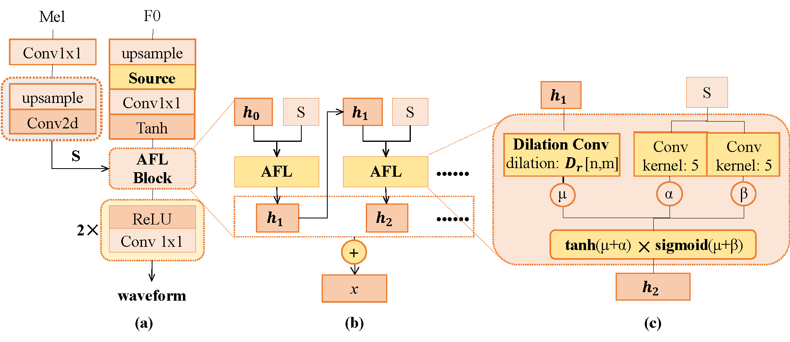
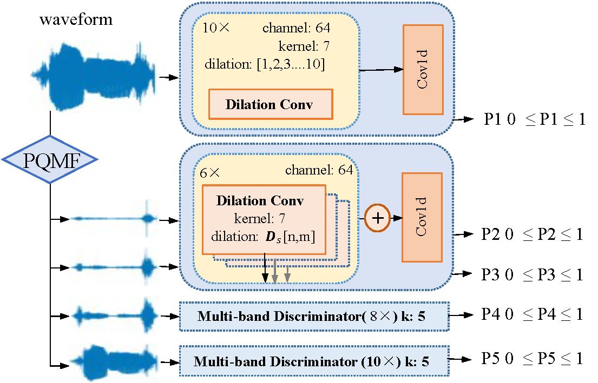

{:.no_toc}
* toc
{:toc}

# Abstract
{: width="75%"}{: .center}  
{: width="85%"}{: .center}  
High-fidelity singing voice synthesis is challenging for neural vocoder due to extremely long continuous pronunciation, 
high sampling rate and strong expressiveness. 
Existing neural vocoders designed for text-to-speech cannot directly be applied to singing voice synthesis since they result in glitch in the generated spectrogram and poor high-frequency reconstruction. 
To tackle the difficulty of singing modeling, in this paper, we propose SingVocoder, 
a source-based universal singing voice vocoder with generative adversarial network. 
Specifically, 1) SingVocoder uses source excitation to alleviate glitch problem in spectrogram; 
and 2) to supervise high-frequency reconstruction, SingVocoder adopts multi-band discriminators and introduces multi-resolution mel-spectrogram loss and feature matching loss. 
To our knowledge, SingVocoder is the first vocoder designed towards high-fidelity multi-speaker singing voice synthesis. 
Experimental results show that SingVocoder synthesizes singing voice with much higher quality (0.41 MOS gains) over the previous method. Further experiments prove that combined with FastSpeech 2 as an acoustic model, 
SingVocoder achieves strong robustness in the singing voice synthesis pipeline and also performs well in speech synthesis. 
Audio samples are available at <a href="https://singvocoder.github.io/"><i>https://singvocoder.github.io/</i></a>.

# Singing Voice Vocoder
## Unseen Speakers

### Woman
<table>
    <thead>
    <th style="text-align: center">Speaker</th>
    <th style="text-align: center">Recording</th>
    <th style="text-align: center">WaveRNN</th>
    <th style="text-align: center">Parallel WaveGAN</th>
    <th style="text-align: center">FB MelGAN</th>
    <th style="text-align: center">SingVocoder</th>
    <th style="text-align: center">
 NSF (Rebuttal)
</th>
    </thead>
    <tbody>
        <tr>
            <th>#1</th>
            <td style="text-align: center"><audio controls style="width: 150px;"><source src="wav_for_demo/unseen-singsing/gt/women/F1_1_03.wav" type="audio/wav"></audio></td>
            <td style="text-align: center"><audio controls style="width: 150px;"><source src="wav_for_demo/unseen-singsing/waveRNN/women/F1_1_03.wav" type="audio/wav"></audio></td>
            <td style="text-align: center"><audio controls style="width: 150px;"><source src="wav_for_demo/unseen-singsing/pwg_all/women/F1_1_03_gen.wav" type="audio/wav"></audio></td>
            <td style="text-align: center"><audio controls style="width: 150px;"><source src="wav_for_demo/unseen-singsing/FBMelGAN/women/F1_1_03.wav" type="audio/wav"></audio></td>
            <td style="text-align: center"><audio controls style="width: 150px;"><source src="wav_for_demo/unseen-singsing/SingVocoder/women/F1_1_03_gen.wav" type="audio/wav"></audio></td>
            <td style="text-align: center"><audio controls style="width: 150px;"><source src="wav_for_demo/unseen-singsing/nsf/women/F1_1_03_gen.wav" type="audio/wav"></audio></td>
        </tr>
    </tbody>
    <tbody>
        <tr>
            <th>#2</th>
            <td style="text-align: center"><audio controls style="width: 150px;"><source src="wav_for_demo/unseen-singsing/gt/women/F3_1_02.wav" type="audio/wav"></audio></td>
            <td style="text-align: center"><audio controls style="width: 150px;"><source src="wav_for_demo/unseen-singsing/waveRNN/women/F3_1_02.wav" type="audio/wav"></audio></td>
            <td style="text-align: center"><audio controls style="width: 150px;"><source src="wav_for_demo/unseen-singsing/pwg_all/women/F3_1_02_gen.wav" type="audio/wav"></audio></td>
            <td style="text-align: center"><audio controls style="width: 150px;"><source src="wav_for_demo/unseen-singsing/FBMelGAN/women/F3_1_02.wav" type="audio/wav"></audio></td>
            <td style="text-align: center"><audio controls style="width: 150px;"><source src="wav_for_demo/unseen-singsing/SingVocoder/women/F3_1_02_gen.wav" type="audio/wav"></audio></td>
            <td style="text-align: center"><audio controls style="width: 150px;"><source src="wav_for_demo/unseen-singsing/nsf/women/F3_1_02_gen.wav" type="audio/wav"></audio></td>
        </tr>
    </tbody>
    <tbody>
        <tr>
            <th>#3</th>
            <td style="text-align: center"><audio controls style="width: 150px;"><source src="wav_for_demo/unseen-singsing/gt/women/F4_2_01.wav" type="audio/wav"></audio></td>
            <td style="text-align: center"><audio controls style="width: 150px;"><source src="wav_for_demo/unseen-singsing/waveRNN/women/F4_2_01.wav" type="audio/wav"></audio></td>
            <td style="text-align: center"><audio controls style="width: 150px;"><source src="wav_for_demo/unseen-singsing/pwg_all/women/F4_2_01_gen.wav" type="audio/wav"></audio></td>
            <td style="text-align: center"><audio controls style="width: 150px;"><source src="wav_for_demo/unseen-singsing/FBMelGAN/women/F4_2_01.wav" type="audio/wav"></audio></td>
            <td style="text-align: center"><audio controls style="width: 150px;"><source src="wav_for_demo/unseen-singsing/SingVocoder/women/F4_2_01_gen.wav" type="audio/wav"></audio></td>
            <td style="text-align: center"><audio controls style="width: 150px;"><source src="wav_for_demo/unseen-singsing/nsf/women/F4_2_01_gen.wav" type="audio/wav"></audio></td>
        </tr>
    </tbody>
        <tbody>
        <tr>
            <th>#4</th>
            <td style="text-align: center"><audio controls style="width: 150px;"><source src="wav_for_demo/unseen-singsing/gt/women/F5_2_02.wav" type="audio/wav"></audio></td>
            <td style="text-align: center"><audio controls style="width: 150px;"><source src="wav_for_demo/unseen-singsing/waveRNN/women/F5_2_02.wav" type="audio/wav"></audio></td>
            <td style="text-align: center"><audio controls style="width: 150px;"><source src="wav_for_demo/unseen-singsing/pwg_all/women/F5_2_02_gen.wav" type="audio/wav"></audio></td>
            <td style="text-align: center"><audio controls style="width: 150px;"><source src="wav_for_demo/unseen-singsing/FBMelGAN/women/F5_2_02.wav" type="audio/wav"></audio></td>
            <td style="text-align: center"><audio controls style="width: 150px;"><source src="wav_for_demo/unseen-singsing/SingVocoder/women/F5_2_02_gen.wav" type="audio/wav"></audio></td>
            <td style="text-align: center"><audio controls style="width: 150px;"><source src="wav_for_demo/unseen-singsing/SingVocoder/nsf/F5_2_02_gen.wav" type="audio/wav"></audio></td>
        </tr>
    </tbody>
    <tbody>
        <tr>
            <th>#5</th>
            <td style="text-align: center"><audio controls style="width: 150px;"><source src="wav_for_demo/unseen-singsing/gt/women/vocal-盛夏的果实_06.wav" type="audio/wav"></audio></td>
            <td style="text-align: center"><audio controls style="width: 150px;"><source src="wav_for_demo/unseen-singsing/waveRNN/women/vocal-盛夏的果实_06.wav" type="audio/wav"></audio></td>
            <td style="text-align: center"><audio controls style="width: 150px;"><source src="wav_for_demo/unseen-singsing/pwg_all/women/vocal-盛夏的果实_06_gen.wav" type="audio/wav"></audio></td>
            <td style="text-align: center"><audio controls style="width: 150px;"><source src="wav_for_demo/unseen-singsing/FBMelGAN/women/vocal-盛夏的果实_06.wav" type="audio/wav"></audio></td>
            <td style="text-align: center"><audio controls style="width: 150px;"><source src="wav_for_demo/unseen-singsing/SingVocoder/women/vocal-盛夏的果实_06_gen.wav" type="audio/wav"></audio></td>
            <td style="text-align: center"><audio controls style="width: 150px;"><source src="wav_for_demo/unseen-singsing/nsf/women/vocal-盛夏的果实_06_gen.wav" type="audio/wav"></audio></td>
        </tr>
    </tbody>
    <tbody>
        <tr>
            <th>#6</th>
            <td style="text-align: center"><audio controls style="width: 150px;"><source src="wav_for_demo/unseen-singsing/gt/women/中文女声DM-001-22.wav" type="audio/wav"></audio></td>
            <td style="text-align: center"><audio controls style="width: 150px;"><source src="wav_for_demo/unseen-singsing/waveRNN/women/中文女声DM-001-22.wav" type="audio/wav"></audio></td>
            <td style="text-align: center"><audio controls style="width: 150px;"><source src="wav_for_demo/unseen-singsing/pwg_all/women/中文女声DM-001-22_gen.wav" type="audio/wav"></audio></td>
            <td style="text-align: center"><audio controls style="width: 150px;"><source src="wav_for_demo/unseen-singsing/FBMelGAN/women/中文女声DM-001-22.wav" type="audio/wav"></audio></td>
            <td style="text-align: center"><audio controls style="width: 150px;"><source src="wav_for_demo/unseen-singsing/SingVocoder/women/中文女声DM-001-22_gen.wav" type="audio/wav"></audio></td>
            <td style="text-align: center"><audio controls style="width: 150px;"><source src="wav_for_demo/unseen-singsing/nsf/women/中文女声DM-001-22_gen.wav" type="audio/wav"></audio></td>
        </tr>
    </tbody>
</table>

### Man
<table>
    <thead>
    <th style="text-align: center">Speaker</th>
    <th style="text-align: center">Recording</th>
    <th style="text-align: center">WaveRNN</th>
    <th style="text-align: center">Parallel WaveGAN</th>
    <th style="text-align: center">FB MelGAN</th>
    <th style="text-align: center">SingVocoder</th>
    <th style="text-align: center">
 NSF (Rebuttal)
</th>
    </thead>
    <tbody>
        <tr>
            <th>#1</th>
            <td style="text-align: center"><audio controls style="width: 150px;"><source src="wav_for_demo/unseen-singsing/gt/man/m4_1_stc2.wav" type="audio/wav"></audio></td>
            <td style="text-align: center"><audio controls style="width: 150px;"><source src="wav_for_demo/unseen-singsing/waveRNN/man/m4_1_stc2.wav" type="audio/wav"></audio></td>
            <td style="text-align: center"><audio controls style="width: 150px;"><source src="wav_for_demo/unseen-singsing/pwg_all/man/m4_1_stc2_gen.wav" type="audio/wav"></audio></td>
            <td style="text-align: center"><audio controls style="width: 150px;"><source src="wav_for_demo/unseen-singsing/FBMelGAN/man/m4_1_stc2.wav" type="audio/wav"></audio></td>
            <td style="text-align: center"><audio controls style="width: 150px;"><source src="wav_for_demo/unseen-singsing/SingVocoder/man/m4_1_stc2_gen.wav" type="audio/wav"></audio></td>
            <td style="text-align: center"><audio controls style="width: 150px;"><source src="wav_for_demo/unseen-singsing/nsf/man/m4_1_stc2_gen.wav" type="audio/wav"></audio></td>
        </tr>
    </tbody>
    <tbody>
        <tr>
            <th>#2</th>
            <td style="text-align: center"><audio controls style="width: 150px;"><source src="wav_for_demo/unseen-singsing/gt/man/m9_2_stc6.wav" type="audio/wav"></audio></td>
            <td style="text-align: center"><audio controls style="width: 150px;"><source src="wav_for_demo/unseen-singsing/waveRNN/man/m9_2_stc6.wav" type="audio/wav"></audio></td>
            <td style="text-align: center"><audio controls style="width: 150px;"><source src="wav_for_demo/unseen-singsing/pwg_all/man/m9_2_stc6_gen.wav" type="audio/wav"></audio></td>
            <td style="text-align: center"><audio controls style="width: 150px;"><source src="wav_for_demo/unseen-singsing/FBMelGAN/man/m9_2_stc6.wav" type="audio/wav"></audio></td>
            <td style="text-align: center"><audio controls style="width: 150px;"><source src="wav_for_demo/unseen-singsing/SingVocoder/man/m9_2_stc6_gen.wav" type="audio/wav"></audio></td>
            <td style="text-align: center"><audio controls style="width: 150px;"><source src="wav_for_demo/unseen-singsing/nsf/man/m9_2_stc6_gen.wav" type="audio/wav"></audio></td>
        </tr>
    </tbody>
    <tbody>
        <tr>
            <th>#3</th>
            <td style="text-align: center"><audio controls style="width: 150px;"><source src="wav_for_demo/unseen-singsing/gt/man/100627002.wav" type="audio/wav"></audio></td>
            <td style="text-align: center"><audio controls style="width: 150px;"><source src="wav_for_demo/unseen-singsing/waveRNN/man/100627002.wav" type="audio/wav"></audio></td>
            <td style="text-align: center"><audio controls style="width: 150px;"><source src="wav_for_demo/unseen-singsing/pwg_all/man/100627002_gen.wav" type="audio/wav"></audio></td>
            <td style="text-align: center"><audio controls style="width: 150px;"><source src="wav_for_demo/unseen-singsing/FBMelGAN/man/100627002.wav" type="audio/wav"></audio></td>
            <td style="text-align: center"><audio controls style="width: 150px;"><source src="wav_for_demo/unseen-singsing/SingVocoder/man/100627002_gen.wav" type="audio/wav"></audio></td>
            <td style="text-align: center"><audio controls style="width: 150px;"><source src="wav_for_demo/unseen-singsing/nsf/man/100627002_gen.wav" type="audio/wav"></audio></td>
        </tr>
    </tbody>
        <tbody>
        <tr>
            <th>#4</th>
            <td style="text-align: center"><audio controls style="width: 150px;"><source src="wav_for_demo/unseen-singsing/gt/man/m2_1_stc1.wav" type="audio/wav"></audio></td>
            <td style="text-align: center"><audio controls style="width: 150px;"><source src="wav_for_demo/unseen-singsing/waveRNN/man/m2_1_stc1.wav" type="audio/wav"></audio></td>
            <td style="text-align: center"><audio controls style="width: 150px;"><source src="wav_for_demo/unseen-singsing/pwg_all/man/m2_1_stc1_gen.wav" type="audio/wav"></audio></td>
            <td style="text-align: center"><audio controls style="width: 150px;"><source src="wav_for_demo/unseen-singsing/FBMelGAN/man/m2_1_stc1.wav" type="audio/wav"></audio></td>
            <td style="text-align: center"><audio controls style="width: 150px;"><source src="wav_for_demo/unseen-singsing/SingVocoder/man/m2_1_stc1_gen.wav" type="audio/wav"></audio></td>
            <td style="text-align: center"><audio controls style="width: 150px;"><source src="wav_for_demo/unseen-singsing/nsf/man/m2_1_stc1_gen.wav" type="audio/wav"></audio></td>
        </tr>
    </tbody>
    <tbody>
        <tr>
            <th>#5</th>
            <td style="text-align: center"><audio controls style="width: 150px;"><source src="wav_for_demo/unseen-singsing/gt/man/m2_2_stc4.wav" type="audio/wav"></audio></td>
            <td style="text-align: center"><audio controls style="width: 150px;"><source src="wav_for_demo/unseen-singsing/waveRNN/man/m2_2_stc4.wav" type="audio/wav"></audio></td>
            <td style="text-align: center"><audio controls style="width: 150px;"><source src="wav_for_demo/unseen-singsing/pwg_all/man/m2_2_stc4_gen.wav" type="audio/wav"></audio></td>
            <td style="text-align: center"><audio controls style="width: 150px;"><source src="wav_for_demo/unseen-singsing/FBMelGAN/man/m2_2_stc4.wav" type="audio/wav"></audio></td>
            <td style="text-align: center"><audio controls style="width: 150px;"><source src="wav_for_demo/unseen-singsing/SingVocoder/man/m2_2_stc4_gen.wav" type="audio/wav"></audio></td>
            <td style="text-align: center"><audio controls style="width: 150px;"><source src="wav_for_demo/unseen-singsing/nsf/man/m2_2_stc4_gen.wav" type="audio/wav"></audio></td>
        </tr>
    </tbody>
    <tbody>
        <tr>
            <th>#6</th>
            <td style="text-align: center"><audio controls style="width: 150px;"><source src="wav_for_demo/unseen-singsing/gt/man/m3_2_stc4.wav" type="audio/wav"></audio></td>
            <td style="text-align: center"><audio controls style="width: 150px;"><source src="wav_for_demo/unseen-singsing/waveRNN/man/m3_2_stc4.wav" type="audio/wav"></audio></td>
            <td style="text-align: center"><audio controls style="width: 150px;"><source src="wav_for_demo/unseen-singsing/pwg_all/man/m3_2_stc4_gen.wav" type="audio/wav"></audio></td>
            <td style="text-align: center"><audio controls style="width: 150px;"><source src="wav_for_demo/unseen-singsing/FBMelGAN/man/m3_2_stc4.wav" type="audio/wav"></audio></td>
            <td style="text-align: center"><audio controls style="width: 150px;"><source src="wav_for_demo/unseen-singsing/SingVocoder/man/m3_2_stc4_gen.wav" type="audio/wav"></audio></td>
            <td style="text-align: center"><audio controls style="width: 150px;"><source src="wav_for_demo/unseen-singsing/nsf/man/m3_2_stc4_gen.wav" type="audio/wav"></audio></td>
        </tr>
    </tbody>
</table>

## Seen Speakers

### Woman

<table>
    <thead>
    <th style="text-align: center">Speaker</th>
    <th style="text-align: center">Recording</th>
    <th style="text-align: center">WaveRNN</th>
    <th style="text-align: center">Parallel WaveGAN</th>
    <th style="text-align: center">FB MelGAN</th>
    <th style="text-align: center">SingVocoder</th>
    <th style="text-align: center">
 NSF (Rebuttal)
</th>
    </thead>
    <tbody>
        <tr>
            <th>#1</th>
            <td style="text-align: center"><audio controls style="width: 150px;"><source src="wav_for_demo/seen-singing/gt/f002-5.wav" type="audio/wav"></audio></td>
            <td style="text-align: center"><audio controls style="width: 150px;"><source src="wav_for_demo/seen-singing/waveRNN_n/f002-5.wav" type="audio/wav"></audio></td>
            <td style="text-align: center"><audio controls style="width: 150px;"><source src="wav_for_demo/seen-singing/pwg/f002-5_gen.wav" type="audio/wav"></audio></td>
            <td style="text-align: center"><audio controls style="width: 150px;"><source src="wav_for_demo/seen-singing/FBMelGAN/f002-5.wav" type="audio/wav"></audio></td>
            <td style="text-align: center"><audio controls style="width: 150px;"><source src="wav_for_demo/seen-singing/SingVocoder/f002-5_gen.wav" type="audio/wav"></audio></td>
            <td style="text-align: center"><audio controls style="width: 150px;"><source src="wav_for_demo/seen-singing/nsf/f002-5_gen.wav" type="audio/wav"></audio></td>
        </tr>
    </tbody>
    <tbody>
        <tr>
            <th>#2</th>
            <td style="text-align: center"><audio controls style="width: 150px;"><source src="wav_for_demo/seen-singing/gt/f005-2.wav" type="audio/wav"></audio></td>
            <td style="text-align: center"><audio controls style="width: 150px;"><source src="wav_for_demo/seen-singing/waveRNN_n/f005-2.wav" type="audio/wav"></audio></td>
            <td style="text-align: center"><audio controls style="width: 150px;"><source src="wav_for_demo/seen-singing/pwg/f005-2_gen.wav" type="audio/wav"></audio></td>
            <td style="text-align: center"><audio controls style="width: 150px;"><source src="wav_for_demo/seen-singing/FBMelGAN/f005-2.wav" type="audio/wav"></audio></td>
            <td style="text-align: center"><audio controls style="width: 150px;"><source src="wav_for_demo/seen-singing/SingVocoder/f005-2_gen.wav" type="audio/wav"></audio></td>
            <td style="text-align: center"><audio controls style="width: 150px;"><source src="wav_for_demo/seen-singing/nsf/f005-2_gen.wav" type="audio/wav"></audio></td>
        </tr>
    </tbody>
    <tbody>
        <tr>
            <th>#3</th>
            <td style="text-align: center"><audio controls style="width: 150px;"><source src="wav_for_demo/seen-singing/gt/f002-6.wav" type="audio/wav"></audio></td>
            <td style="text-align: center"><audio controls style="width: 150px;"><source src="wav_for_demo/seen-singing/waveRNN_n/f002-6.wav" type="audio/wav"></audio></td>
            <td style="text-align: center"><audio controls style="width: 150px;"><source src="wav_for_demo/seen-singing/pwg/f002-6_gen.wav" type="audio/wav"></audio></td>
            <td style="text-align: center"><audio controls style="width: 150px;"><source src="wav_for_demo/seen-singing/FBMelGAN/f002-6.wav" type="audio/wav"></audio></td>
            <td style="text-align: center"><audio controls style="width: 150px;"><source src="wav_for_demo/seen-singing/SingVocoder/f002-6_gen.wav" type="audio/wav"></audio></td>
            <td style="text-align: center"><audio controls style="width: 150px;"><source src="wav_for_demo/seen-singing/nsf/f002-6_gen.wav" type="audio/wav"></audio></td>
        </tr>
    </tbody>
    <tbody>
        <tr>
            <th>#4</th>
            <td style="text-align: center"><audio controls style="width: 150px;"><source src="wav_for_demo/seen-singing/gt/f002-2.wav" type="audio/wav"></audio></td>
            <td style="text-align: center"><audio controls style="width: 150px;"><source src="wav_for_demo/seen-singing/waveRNN_n/f002-2.wav" type="audio/wav"></audio></td>
            <td style="text-align: center"><audio controls style="width: 150px;"><source src="wav_for_demo/seen-singing/pwg/f002-2_gen.wav" type="audio/wav"></audio></td>
            <td style="text-align: center"><audio controls style="width: 150px;"><source src="wav_for_demo/seen-singing/FBMelGAN/f002-2.wav" type="audio/wav"></audio></td>
            <td style="text-align: center"><audio controls style="width: 150px;"><source src="wav_for_demo/seen-singing/SingVocoder/f002-2_gen.wav" type="audio/wav"></audio></td>
            <td style="text-align: center"><audio controls style="width: 150px;"><source src="wav_for_demo/seen-singing/nsf/f002-2_gen.wav" type="audio/wav"></audio></td>
        </tr>
    </tbody>
    <tbody>
        <tr>
            <th>#5</th>
            <td style="text-align: center"><audio controls style="width: 150px;"><source src="wav_for_demo/seen-singing/gt/f005-6.wav" type="audio/wav"></audio></td>
            <td style="text-align: center"><audio controls style="width: 150px;"><source src="wav_for_demo/seen-singing/waveRNN_n/f005-6.wav" type="audio/wav"></audio></td>
            <td style="text-align: center"><audio controls style="width: 150px;"><source src="wav_for_demo/seen-singing/pwg/f005-6_gen.wav" type="audio/wav"></audio></td>
            <td style="text-align: center"><audio controls style="width: 150px;"><source src="wav_for_demo/seen-singing/FBMelGAN/f005-6.wav" type="audio/wav"></audio></td>
            <td style="text-align: center"><audio controls style="width: 150px;"><source src="wav_for_demo/seen-singing/SingVocoder/f005-6_gen.wav" type="audio/wav"></audio></td>
            <td style="text-align: center"><audio controls style="width: 150px;"><source src="wav_for_demo/seen-singing/nsf/f005-6_gen.wav" type="audio/wav"></audio></td>
        </tr>
    </tbody>
    <tbody>
        <tr>
            <th>#6</th>
            <td style="text-align: center"><audio controls style="width: 150px;"><source src="wav_for_demo/seen-singing/gt/f005-9.wav" type="audio/wav"></audio></td>
            <td style="text-align: center"><audio controls style="width: 150px;"><source src="wav_for_demo/seen-singing/waveRNN_n/f005-9.wav" type="audio/wav"></audio></td>
            <td style="text-align: center"><audio controls style="width: 150px;"><source src="wav_for_demo/seen-singing/pwg/f005-9_gen.wav" type="audio/wav"></audio></td>
            <td style="text-align: center"><audio controls style="width: 150px;"><source src="wav_for_demo/seen-singing/FBMelGAN/f005-9.wav" type="audio/wav"></audio></td>
            <td style="text-align: center"><audio controls style="width: 150px;"><source src="wav_for_demo/seen-singing/SingVocoder/f005-9_gen.wav" type="audio/wav"></audio></td>
            <td style="text-align: center"><audio controls style="width: 150px;"><source src="wav_for_demo/seen-singing/nsf/f005-9_gen.wav" type="audio/wav"></audio></td>
        </tr>
    </tbody>
</table>

### Man

<table>
    <thead>
    <th style="text-align: center">Speaker</th>
    <th style="text-align: center">Recording</th>
    <th style="text-align: center">WaveRNN</th>
    <th style="text-align: center">Parallel WaveGAN</th>
    <th style="text-align: center">FB MelGAN</th>
    <th style="text-align: center">SingVocoder</th>
    <th style="text-align: center">
 NSF (Rebuttal)
</th>
    </thead>
    <tbody>
        <tr>
            <th>#1</th>
            <td style="text-align: center"><audio controls style="width: 150px;"><source src="wav_for_demo/seen-singing/gt/004-10.wav" type="audio/wav"></audio></td>
            <td style="text-align: center"><audio controls style="width: 150px;"><source src="wav_for_demo/seen-singing/waveRNN_n/004-10_wavernn_0.wav" type="audio/wav"></audio></td>
            <td style="text-align: center"><audio controls style="width: 150px;"><source src="wav_for_demo/seen-singing/pwg/004-10_gen.wav" type="audio/wav"></audio></td>
            <td style="text-align: center"><audio controls style="width: 150px;"><source src="wav_for_demo/seen-singing/FBMelGAN/004-10.wav" type="audio/wav"></audio></td>
            <td style="text-align: center"><audio controls style="width: 150px;"><source src="wav_for_demo/seen-singing/SingVocoder/004-10_gen.wav" type="audio/wav"></audio></td>
            <td style="text-align: center"><audio controls style="width: 150px;"><source src="wav_for_demo/seen-singing/nsf/004-10_gen.wav" type="audio/wav"></audio></td>
        </tr>
    </tbody>
    <tbody>
        <tr>
            <th>#2</th>
            <td style="text-align: center"><audio controls style="width: 150px;"><source src="wav_for_demo/seen-singing/gt/004-9.wav" type="audio/wav"></audio></td>
            <td style="text-align: center"><audio controls style="width: 150px;"><source src="wav_for_demo/seen-singing/waveRNN_n/004-9_wavernn_0.wav" type="audio/wav"></audio></td>
            <td style="text-align: center"><audio controls style="width: 150px;"><source src="wav_for_demo/seen-singing/pwg/004-9_gen.wav" type="audio/wav"></audio></td>
            <td style="text-align: center"><audio controls style="width: 150px;"><source src="wav_for_demo/seen-singing/FBMelGAN/004-9.wav" type="audio/wav"></audio></td>
            <td style="text-align: center"><audio controls style="width: 150px;"><source src="wav_for_demo/seen-singing/SingVocoder/004-9_gen.wav" type="audio/wav"></audio></td>
            <td style="text-align: center"><audio controls style="width: 150px;"><source src="wav_for_demo/seen-singing/nsf/004-9_gen.wav" type="audio/wav"></audio></td>
        </tr>
    </tbody>
    <tbody>
        <tr>
            <th>#3</th>
            <td style="text-align: center"><audio controls style="width: 150px;"><source src="wav_for_demo/seen-singing/gt/005-9.wav" type="audio/wav"></audio></td>
            <td style="text-align: center"><audio controls style="width: 150px;"><source src="wav_for_demo/seen-singing/waveRNN_n/005-9_wavernn_0.wav" type="audio/wav"></audio></td>
            <td style="text-align: center"><audio controls style="width: 150px;"><source src="wav_for_demo/seen-singing/pwg/005-9_gen.wav" type="audio/wav"></audio></td>
            <td style="text-align: center"><audio controls style="width: 150px;"><source src="wav_for_demo/seen-singing/FBMelGAN/005-9.wav" type="audio/wav"></audio></td>
            <td style="text-align: center"><audio controls style="width: 150px;"><source src="wav_for_demo/seen-singing/SingVocoder/005-9_gen.wav" type="audio/wav"></audio></td>
            <td style="text-align: center"><audio controls style="width: 150px;"><source src="wav_for_demo/seen-singing/nsf/005-9_gen.wav" type="audio/wav"></audio></td>
        </tr>
    </tbody>
    <tbody>
        <tr>
            <th>#4</th>
            <td style="text-align: center"><audio controls style="width: 150px;"><source src="wav_for_demo/seen-singing/gt/005-1.wav" type="audio/wav"></audio></td>
            <td style="text-align: center"><audio controls style="width: 150px;"><source src="wav_for_demo/seen-singing/waveRNN_n/005-1_wavernn_0.wav" type="audio/wav"></audio></td>
            <td style="text-align: center"><audio controls style="width: 150px;"><source src="wav_for_demo/seen-singing/pwg/005-1_gen.wav" type="audio/wav"></audio></td>
            <td style="text-align: center"><audio controls style="width: 150px;"><source src="wav_for_demo/seen-singing/FBMelGAN/005-1.wav" type="audio/wav"></audio></td>
            <td style="text-align: center"><audio controls style="width: 150px;"><source src="wav_for_demo/seen-singing/SingVocoder/005-1_gen.wav" type="audio/wav"></audio></td>
            <td style="text-align: center"><audio controls style="width: 150px;"><source src="wav_for_demo/seen-singing/nsf/005-1_gen.wav" type="audio/wav"></audio></td>
        </tr>
    </tbody>
    <tbody>
        <tr>
            <th>#5</th>
            <td style="text-align: center"><audio controls style="width: 150px;"><source src="wav_for_demo/seen-singing/gt/004-7.wav" type="audio/wav"></audio></td>
            <td style="text-align: center"><audio controls style="width: 150px;"><source src="wav_for_demo/seen-singing/waveRNN_n/004-7_wavernn_0.wav" type="audio/wav"></audio></td>
            <td style="text-align: center"><audio controls style="width: 150px;"><source src="wav_for_demo/seen-singing/pwg/004-7_gen.wav" type="audio/wav"></audio></td>
            <td style="text-align: center"><audio controls style="width: 150px;"><source src="wav_for_demo/seen-singing/FBMelGAN/004-7.wav" type="audio/wav"></audio></td>
            <td style="text-align: center"><audio controls style="width: 150px;"><source src="wav_for_demo/seen-singing/SingVocoder/004-7_gen.wav" type="audio/wav"></audio></td>
            <td style="text-align: center"><audio controls style="width: 150px;"><source src="wav_for_demo/seen-singing/nsf/004-7_gen.wav" type="audio/wav"></audio></td>
        </tr>
    </tbody>
    <tbody>
        <tr>
            <th>#6</th>
            <td style="text-align: center"><audio controls style="width: 150px;"><source src="wav_for_demo/seen-singing/gt/005-8.wav" type="audio/wav"></audio></td>
            <td style="text-align: center"><audio controls style="width: 150px;"><source src="wav_for_demo/seen-singing/waveRNN_n/005-8_wavernn_0.wav" type="audio/wav"></audio></td>
            <td style="text-align: center"><audio controls style="width: 150px;"><source src="wav_for_demo/seen-singing/pwg/005-8_gen.wav" type="audio/wav"></audio></td>
            <td style="text-align: center"><audio controls style="width: 150px;"><source src="wav_for_demo/seen-singing/FBMelGAN/005-8.wav" type="audio/wav"></audio></td>
            <td style="text-align: center"><audio controls style="width: 150px;"><source src="wav_for_demo/seen-singing/SingVocoder/005-8_gen.wav" type="audio/wav"></audio></td>
            <td style="text-align: center"><audio controls style="width: 150px;"><source src="wav_for_demo/seen-singing/nsf/005-8_gen.wav" type="audio/wav"></audio></td>
        </tr>
    </tbody>    
</table>

# Singing Voice Synthesis

<ruby>庄  稼  早  已  收  割  完<rt style="font-size: 15px;">zhuang jia zao yi shou ge wan</rt>
</ruby>
<table>
	<thead>
		<tr>
			<th style="text-align: center">Recording</th>
			<th style="text-align: center">FastSpeech2+Parallel WaveGAN</th>
			<th style="text-align: center">FastSpeech2+SingVocoder</th>
		</tr>
	</thead>
	<tbody>
		<tr>
			<td style="text-align: center"><audio controls style="width: 150px;"><source src="wav_for_demo/svs/GT/[G]庄稼早已收割完_gen.wav" type="audio/wav"></audio></td>
			<td style="text-align: center"><audio controls style="width: 150px;"><source src="wav_for_demo/svs/fs2+pwg/[P]庄稼早已收割完.wav" type="audio/wav"></audio></td>
			<td style="text-align: center"><audio controls style="width: 150px;"><source src="wav_for_demo/svs/fs2+singvocoder/女_2_2-父亲写的散文诗_22][P]庄稼早已收割完.wav" type="audio/wav"></audio></td>
		</tr>
	</tbody>
</table>

<ruby>我 的 老 母 亲 去 年 离 开 了 人 间<rt style="font-size: 15px;">wo de lao mu qin qu nian li kai le ren jian</rt>
</ruby>
<table>
	<thead>
		<tr>
			<th style="text-align: center">Recording</th>
			<th style="text-align: center">FastSpeech2+Parallel WaveGAN</th>
			<th style="text-align: center">FastSpeech2+SingVocoder</th>
		</tr>
	</thead>
	<tbody>
		<tr>
			<td style="text-align: center"><audio controls style="width: 150px;"><source src="wav_for_demo/svs/GT/[G]我的老母亲去年离开了人间_gen.wav" type="audio/wav"></audio></td>
			<td style="text-align: center"><audio controls style="width: 150px;"><source src="wav_for_demo/svs/fs2+pwg/[P]我的老母亲去年离开了人间.wav" type="audio/wav"></audio></td>
			<td style="text-align: center"><audio controls style="width: 150px;"><source src="wav_for_demo/svs/fs2+singvocoder/女_2_2-父亲写的散文诗_23][P]我的老母亲去年离开了人间.wav" type="audio/wav"></audio></td>
		</tr>
	</tbody>
</table>

<ruby>我 老 成 了 一 堆 旧 纸 钱<rt style="font-size: 15px;">wo lao cheng le yi dui jiu zhi qian</rt>
</ruby>
<table>
	<thead>
		<tr>
			<th style="text-align: center">Recording</th>
			<th style="text-align: center">FastSpeech2+Parallel WaveGAN</th>
			<th style="text-align: center">FastSpeech2+SingVocoder</th>
		</tr>
	</thead>
	<tbody>
		<tr>
			<td style="text-align: center"><audio controls style="width: 150px;"><source src="wav_for_demo/svs/GT/[G]我老成了一堆旧纸钱_gen.wav" type="audio/wav"></audio></td>
			<td style="text-align: center"><audio controls style="width: 150px;"><source src="wav_for_demo/svs/fs2+pwg/[P]我老成了一堆旧纸钱.wav" type="audio/wav"></audio></td>
			<td style="text-align: center"><audio controls style="width: 150px;"><source src="wav_for_demo/svs/fs2+singvocoder/女_2_2-父亲写的散文诗_28][P]我老成了一堆旧纸钱.wav" type="audio/wav"></audio></td>
		</tr>
	</tbody>
</table>

<ruby>留 下 来 的 散 文 诗<rt style="font-size: 15px;">liu xia lai de san wen shi</rt>
</ruby>
<table>
	<thead>
		<tr>
			<th style="text-align: center">Recording</th>
			<th style="text-align: center">FastSpeech2+Parallel WaveGAN</th>
			<th style="text-align: center">FastSpeech2+SingVocoder</th>
		</tr>
	</thead>
	<tbody>
		<tr>
			<td style="text-align: center"><audio controls style="width: 150px;"><source src="wav_for_demo/svs/GT/[G]留下来的散文诗_gen.wav" type="audio/wav"></audio></td>
			<td style="text-align: center"><audio controls style="width: 150px;"><source src="wav_for_demo/svs/fs2+pwg/[P]留下来的散文诗.wav" type="audio/wav"></audio></td>
			<td style="text-align: center"><audio controls style="width: 150px;"><source src="wav_for_demo/svs/fs2+singvocoder/女_2_2-父亲写的散文诗_36][P]留下来的散文诗.wav" type="audio/wav"></audio></td>
		</tr>
	</tbody>
</table>

<ruby>就 算 很 受 伤 也 不 闪 泪 光<rt style="font-size: 15px;">jiu suan hen shou shang ye bu shan lei guang</rt>
</ruby>
<table>
	<thead>
		<tr>
			<th style="text-align: center">Recording</th>
			<th style="text-align: center">FastSpeech2+Parallel WaveGAN</th>
			<th style="text-align: center">FastSpeech2+SingVocoder</th>
		</tr>
	</thead>
	<tbody>
		<tr>
			<td style="text-align: center"><audio controls style="width: 150px;"><source src="wav_for_demo/svs/GT/[G]就算很受伤也不闪泪光_gen.wav" type="audio/wav"></audio></td>
			<td style="text-align: center"><audio controls style="width: 150px;"><source src="wav_for_demo/svs/fs2+pwg/[P]就算很受伤也不闪泪光.wav" type="audio/wav"></audio></td>
			<td style="text-align: center"><audio controls style="width: 150px;"><source src="wav_for_demo/svs/fs2+singvocoder/女_2_4-隐形的翅膀_3][P]就算很受伤也不闪泪光.wav" type="audio/wav"></audio></td>
		</tr>
	</tbody>
</table>

<ruby>带 我 飞 飞 过 绝 望<rt style="font-size: 15px;">dai wo fei fei guo jue wang</rt>
</ruby>
<table>
	<thead>
		<tr>
			<th style="text-align: center">Recording</th>
			<th style="text-align: center">FastSpeech2+Parallel WaveGAN</th>
			<th style="text-align: center">FastSpeech2+SingVocoder</th>
		</tr>
	</thead>
	<tbody>
		<tr>
			<td style="text-align: center"><audio controls style="width: 150px;"><source src="wav_for_demo/svs/GT/[G]带我飞飞过绝望_gen.wav" type="audio/wav"></audio></td>
			<td style="text-align: center"><audio controls style="width: 150px;"><source src="wav_for_demo/svs/fs2+pwg/[P]带我飞飞过绝望.wav" type="audio/wav"></audio></td>
			<td style="text-align: center"><audio controls style="width: 150px;"><source src="wav_for_demo/svs/fs2+singvocoder/女_2_4-隐形的翅膀_6][P]带我飞飞过绝望.wav" type="audio/wav"></audio></td>
		</tr>
	</tbody>
</table>

<ruby>就 飞 多 远 吧<rt style="font-size: 15px;">jiu fei duo yuan ba</rt>
</ruby>
<table>
	<thead>
		<tr>
			<th style="text-align: center">Recording</th>
			<th style="text-align: center">FastSpeech2+Parallel WaveGAN</th>
			<th style="text-align: center">FastSpeech2+SingVocoder</th>
		</tr>
	</thead>
	<tbody>
		<tr>
			<td style="text-align: center"><audio controls style="width: 150px;"><source src="wav_for_demo/svs/GT/[G]就飞多远吧_gen.wav" type="audio/wav"></audio></td>
			<td style="text-align: center"><audio controls style="width: 150px;"><source src="wav_for_demo/svs/fs2+pwg/[P]就飞多远吧.wav" type="audio/wav"></audio></td>
			<td style="text-align: center"><audio controls style="width: 150px;"><source src="wav_for_demo/svs/fs2+singvocoder/女_2_4-隐形的翅膀_35][P]就飞多远吧.wav" type="audio/wav"></audio></td>
		</tr>
	</tbody>
</table>

<ruby>看 海 天 一 色 听 风 起 雨 落<rt style="font-size: 15px;">kan hai tian yi se ting feng qi yu luo</rt>
</ruby>
<table>
	<thead>
		<tr>
			<th style="text-align: center">Recording</th>
			<th style="text-align: center">FastSpeech2+Parallel WaveGAN</th>
			<th style="text-align: center">FastSpeech2+SingVocoder</th>
		</tr>
	</thead>
	<tbody>
		<tr>
			<td style="text-align: center"><audio controls style="width: 150px;"><source src="wav_for_demo/svs/GT/[G]看海天一色听风起雨落_gen.wav" type="audio/wav"></audio></td>
			<td style="text-align: center"><audio controls style="width: 150px;"><source src="wav_for_demo/svs/fs2+pwg/[P]看海天一色听风起雨落.wav" type="audio/wav"></audio></td>
			<td style="text-align: center"><audio controls style="width: 150px;"><source src="wav_for_demo/svs/fs2+singvocoder/2-6_0156_大鱼_杨沁颖_16][P]看海天一色听风起雨落.wav" type="audio/wav"></audio></td>
		</tr>
	</tbody>
</table>

<ruby>我 松 开 时 间 的 绳 索<rt style="font-size: 15px;">wo song kai shi jian de sheng suo</rt>
</ruby>
<table>
	<thead>
		<tr>
			<th style="text-align: center">Recording</th>
			<th style="text-align: center">FastSpeech2+Parallel WaveGAN</th>
			<th style="text-align: center">FastSpeech2+SingVocoder</th>
		</tr>
	</thead>
	<tbody>
		<tr>
			<td style="text-align: center"><audio controls style="width: 150px;"><source src="wav_for_demo/svs/GT/[G]我松开时间的绳索_gen.wav" type="audio/wav"></audio></td>
			<td style="text-align: center"><audio controls style="width: 150px;"><source src="wav_for_demo/svs/fs2+pwg/[P]我松开时间的绳索.wav" type="audio/wav"></audio></td>
			<td style="text-align: center"><audio controls style="width: 150px;"><source src="wav_for_demo/svs/fs2+singvocoder/2-6_0156_大鱼_杨沁颖_19][P]我松开时间的绳索.wav" type="audio/wav"></audio></td>
		</tr>
	</tbody>
</table>

<ruby>原 来 你 生 来 就 属 于 天 际<rt style="font-size: 15px;">yuan lai ni sheng lai jiu shu yu tian ji</rt>
</ruby>
<table>
	<thead>
		<tr>
			<th style="text-align: center">Recording</th>
			<th style="text-align: center">FastSpeech2+Parallel WaveGAN</th>
			<th style="text-align: center">FastSpeech2+SingVocoder</th>
		</tr>
	</thead>
	<tbody>
		<tr>
			<td style="text-align: center"><audio controls style="width: 150px;"><source src="wav_for_demo/svs/GT/[G]原来你生来就属于天际_gen.wav" type="audio/wav"></audio></td>
			<td style="text-align: center"><audio controls style="width: 150px;"><source src="wav_for_demo/svs/fs2+pwg/[P]原来你生来就属于天际.wav" type="audio/wav"></audio></td>
			<td style="text-align: center"><audio controls style="width: 150px;"><source src="wav_for_demo/svs/fs2+singvocoder/2-6_0156_大鱼_杨沁颖_21][P]原来你生来就属于天际.wav" type="audio/wav"></audio></td>
		</tr>
	</tbody>
</table>

<ruby>每 一 滴 泪 水 都 向 你 流 淌 去<rt style="font-size: 15px;">mei yi di lei shui dou xiang ni liu tang qu</rt>
</ruby>
<table>
	<thead>
		<tr>
			<th style="text-align: center">Recording</th>
			<th style="text-align: center">FastSpeech2+Parallel WaveGAN</th>
			<th style="text-align: center">FastSpeech2+SingVocoder</th>
		</tr>
	</thead>
	<tbody>
		<tr>
			<td style="text-align: center"><audio controls style="width: 150px;"><source src="wav_for_demo/svs/GT/[G]每一滴泪水都向你流淌去_gen.wav" type="audio/wav"></audio></td>
			<td style="text-align: center"><audio controls style="width: 150px;"><source src="wav_for_demo/svs/fs2+pwg/[P]每一滴泪水都向你流淌去.wav" type="audio/wav"></audio></td>
			<td style="text-align: center"><audio controls style="width: 150px;"><source src="wav_for_demo/svs/fs2+singvocoder/2-6_0156_大鱼_杨沁颖_22][P]每一滴泪水都向你流淌去.wav" type="audio/wav"></audio></td>
		</tr>
	</tbody>
</table>

# Speech

## Mandarin

<table>
    <thead>
    <th style="text-align: center">Speaker</th>
    <th style="text-align: center">Recording</th>
    <th style="text-align: center">WaveRNN</th>
    <th style="text-align: center">Parallel WaveGAN</th>
    <th style="text-align: center">FB MelGAN</th>
    <th style="text-align: center">SingVocoder</th>
    </thead>
    <tbody>
        <tr>
            <th>#1</th>
            <td style="text-align: center"><audio controls style="width: 150px;"><source src="wav_for_demo/speech/mandarin/gt/009951.wav" type="audio/wav"></audio></td>
            <td style="text-align: center"><audio controls style="width: 150px;"><source src="wav_for_demo/speech/mandarin/WaveRNN/009951.npy__740k_steps_gen_NOT_BATCHED.wav" type="audio/wav"></audio></td>
            <td style="text-align: center"><audio controls style="width: 150px;"><source src="wav_for_demo/speech/mandarin/pwg/009951_gen.wav" type="audio/wav"></audio></td>
            <td style="text-align: center"><audio controls style="width: 150px;"><source src="wav_for_demo/speech/mandarin/melgan/009951_gen.wav" type="audio/wav"></audio></td>
            <td style="text-align: center"><audio controls style="width: 150px;"><source src="wav_for_demo/speech/mandarin/singvocoder/009951_gen.wav" type="audio/wav"></audio></td>
        </tr>
    </tbody>
    <tbody>
        <tr>
            <th>#2</th>
            <td style="text-align: center"><audio controls style="width: 150px;"><source src="wav_for_demo/speech/mandarin/gt/009952.wav" type="audio/wav"></audio></td>
            <td style="text-align: center"><audio controls style="width: 150px;"><source src="wav_for_demo/speech/mandarin/WaveRNN/009952.npy__740k_steps_gen_NOT_BATCHED.wav" type="audio/wav"></audio></td>
            <td style="text-align: center"><audio controls style="width: 150px;"><source src="wav_for_demo/speech/mandarin/pwg/009952_gen.wav" type="audio/wav"></audio></td>
            <td style="text-align: center"><audio controls style="width: 150px;"><source src="wav_for_demo/speech/mandarin/melgan/009952_gen.wav" type="audio/wav"></audio></td>
            <td style="text-align: center"><audio controls style="width: 150px;"><source src="wav_for_demo/speech/mandarin/singvocoder/009952_gen.wav" type="audio/wav"></audio></td>
        </tr>
    </tbody>
    <tbody>
        <tr>
            <th>#3</th>
            <td style="text-align: center"><audio controls style="width: 150px;"><source src="wav_for_demo/speech/mandarin/gt/009953.wav" type="audio/wav"></audio></td>
            <td style="text-align: center"><audio controls style="width: 150px;"><source src="wav_for_demo/speech/mandarin/WaveRNN/009953.npy__740k_steps_gen_NOT_BATCHED.wav" type="audio/wav"></audio></td>
            <td style="text-align: center"><audio controls style="width: 150px;"><source src="wav_for_demo/speech/mandarin/pwg/009953_gen.wav" type="audio/wav"></audio></td>
            <td style="text-align: center"><audio controls style="width: 150px;"><source src="wav_for_demo/speech/mandarin/melgan/009953_gen.wav" type="audio/wav"></audio></td>
            <td style="text-align: center"><audio controls style="width: 150px;"><source src="wav_for_demo/speech/mandarin/singvocoder/009953_gen.wav" type="audio/wav"></audio></td>
        </tr>
    </tbody>
    <tbody>
        <tr>
            <th>#4</th>
            <td style="text-align: center"><audio controls style="width: 150px;"><source src="wav_for_demo/speech/mandarin/gt/009954.wav" type="audio/wav"></audio></td>
            <td style="text-align: center"><audio controls style="width: 150px;"><source src="wav_for_demo/speech/mandarin/WaveRNN/009954.npy__740k_steps_gen_NOT_BATCHED.wav" type="audio/wav"></audio></td>
            <td style="text-align: center"><audio controls style="width: 150px;"><source src="wav_for_demo/speech/mandarin/pwg/009954_gen.wav" type="audio/wav"></audio></td>
            <td style="text-align: center"><audio controls style="width: 150px;"><source src="wav_for_demo/speech/mandarin/melgan/009954_gen.wav" type="audio/wav"></audio></td>
            <td style="text-align: center"><audio controls style="width: 150px;"><source src="wav_for_demo/speech/mandarin/singvocoder/009954_gen.wav" type="audio/wav"></audio></td>
        </tr>
    </tbody>
    <tbody>
        <tr>
            <th>#5</th>
            <td style="text-align: center"><audio controls style="width: 150px;"><source src="wav_for_demo/speech/mandarin/gt/009955.wav" type="audio/wav"></audio></td>
            <td style="text-align: center"><audio controls style="width: 150px;"><source src="wav_for_demo/speech/mandarin/WaveRNN/009955.npy__740k_steps_gen_NOT_BATCHED.wav" type="audio/wav"></audio></td>
            <td style="text-align: center"><audio controls style="width: 150px;"><source src="wav_for_demo/speech/mandarin/pwg/009955_gen.wav" type="audio/wav"></audio></td>
            <td style="text-align: center"><audio controls style="width: 150px;"><source src="wav_for_demo/speech/mandarin/melgan/009955_gen.wav" type="audio/wav"></audio></td>
            <td style="text-align: center"><audio controls style="width: 150px;"><source src="wav_for_demo/speech/mandarin/singvocoder/009955_gen.wav" type="audio/wav"></audio></td>
        </tr>
    </tbody> 
</table>

## English

<table>
    <thead>
    <th style="text-align: center">Speaker</th>
    <th style="text-align: center">Recording</th>
    <th style="text-align: center">WaveRNN</th>
    <th style="text-align: center">Parallel WaveGAN</th>
    <th style="text-align: center">FB MelGAN</th>
    <th style="text-align: center">SingVocoder</th>
    </thead>
    <tbody>
        <tr>
            <th>#1</th>
            <td style="text-align: center"><audio controls style="width: 150px;"><source src="wav_for_demo/speech/English/gt/p225_353.wav" type="audio/wav"></audio></td>
            <td style="text-align: center"><audio controls style="width: 150px;"><source src="wav_for_demo/speech/English/WaveRNN/p225_353.npy__500k_steps_gen_NOT_BATCHED.wav" type="audio/wav"></audio></td>
            <td style="text-align: center"><audio controls style="width: 150px;"><source src="wav_for_demo/speech/English/pwg/p225_353_gen.wav" type="audio/wav"></audio></td>
            <td style="text-align: center"><audio controls style="width: 150px;"><source src="wav_for_demo/speech/English/melgan/p225_353_gen.wav" type="audio/wav"></audio></td>
            <td style="text-align: center"><audio controls style="width: 150px;"><source src="wav_for_demo/speech/English/singvocoder/p225_353_gen.wav" type="audio/wav"></audio></td>
        </tr>
    </tbody>
    <tbody>
        <tr>
            <th>#2</th>
            <td style="text-align: center"><audio controls style="width: 150px;"><source src="wav_for_demo/speech/English/gt/p226_361.wav" type="audio/wav"></audio></td>
            <td style="text-align: center"><audio controls style="width: 150px;"><source src="wav_for_demo/speech/English/WaveRNN/p226_361.npy__500k_steps_gen_NOT_BATCHED.wav" type="audio/wav"></audio></td>
            <td style="text-align: center"><audio controls style="width: 150px;"><source src="wav_for_demo/speech/English/pwg/p226_361_gen.wav" type="audio/wav"></audio></td>
            <td style="text-align: center"><audio controls style="width: 150px;"><source src="wav_for_demo/speech/English/melgan/p226_361_gen.wav" type="audio/wav"></audio></td>
            <td style="text-align: center"><audio controls style="width: 150px;"><source src="wav_for_demo/speech/English/singvocoder/p226_361_gen.wav" type="audio/wav"></audio></td>
        </tr>
    </tbody>
    <tbody>
        <tr>
            <th>#3</th>
            <td style="text-align: center"><audio controls style="width: 150px;"><source src="wav_for_demo/speech/English/gt/p227_393.wav" type="audio/wav"></audio></td>
            <td style="text-align: center"><audio controls style="width: 150px;"><source src="wav_for_demo/speech/English/WaveRNN/p227_393.npy__500k_steps_gen_NOT_BATCHED.wav" type="audio/wav"></audio></td>
            <td style="text-align: center"><audio controls style="width: 150px;"><source src="wav_for_demo/speech/English/pwg/p227_393_gen.wav" type="audio/wav"></audio></td>
            <td style="text-align: center"><audio controls style="width: 150px;"><source src="wav_for_demo/speech/English/melgan/p227_393_gen.wav" type="audio/wav"></audio></td>
            <td style="text-align: center"><audio controls style="width: 150px;"><source src="wav_for_demo/speech/English/singvocoder/p227_393_gen.wav" type="audio/wav"></audio></td>
        </tr>
    </tbody>
    <tbody>
        <tr>
            <th>#4</th>
            <td style="text-align: center"><audio controls style="width: 150px;"><source src="wav_for_demo/speech/English/gt/p229_381.wav" type="audio/wav"></audio></td>
            <td style="text-align: center"><audio controls style="width: 150px;"><source src="wav_for_demo/speech/English/WaveRNN/p229_381.npy__500k_steps_gen_NOT_BATCHED.wav" type="audio/wav"></audio></td>
            <td style="text-align: center"><audio controls style="width: 150px;"><source src="wav_for_demo/speech/English/pwg/p229_381_gen.wav" type="audio/wav"></audio></td>
            <td style="text-align: center"><audio controls style="width: 150px;"><source src="wav_for_demo/speech/English/melgan/p229_381_gen.wav" type="audio/wav"></audio></td>
            <td style="text-align: center"><audio controls style="width: 150px;"><source src="wav_for_demo/speech/English/singvocoder/p229_381_gen.wav" type="audio/wav"></audio></td>
        </tr>
    </tbody>
    <tbody>
        <tr>
            <th>#5</th>
            <td style="text-align: center"><audio controls style="width: 150px;"><source src="wav_for_demo/speech/English/gt/p230_407.wav" type="audio/wav"></audio></td>
            <td style="text-align: center"><audio controls style="width: 150px;"><source src="wav_for_demo/speech/English/WaveRNN/p230_407.npy__500k_steps_gen_NOT_BATCHED.wav" type="audio/wav"></audio></td>
            <td style="text-align: center"><audio controls style="width: 150px;"><source src="wav_for_demo/speech/English/pwg/p230_407_gen.wav" type="audio/wav"></audio></td>
            <td style="text-align: center"><audio controls style="width: 150px;"><source src="wav_for_demo/speech/English/melgan/p230_407_gen.wav" type="audio/wav"></audio></td>
            <td style="text-align: center"><audio controls style="width: 150px;"><source src="wav_for_demo/speech/English/singvocoder/p230_407_gen.wav" type="audio/wav"></audio></td>
        </tr>
    </tbody> 
</table>
